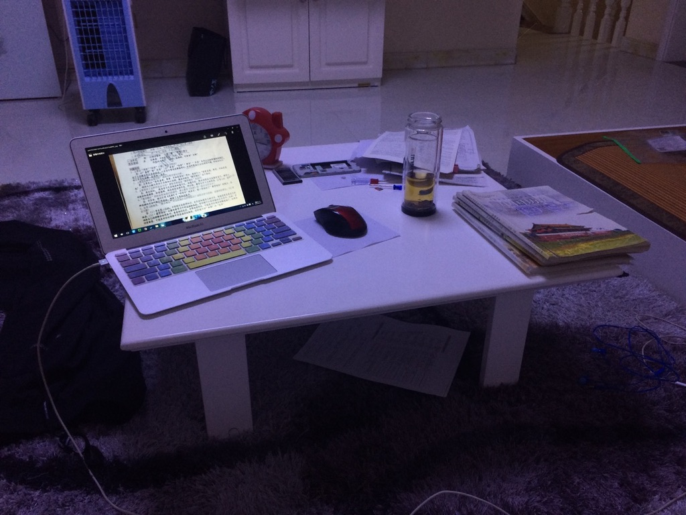
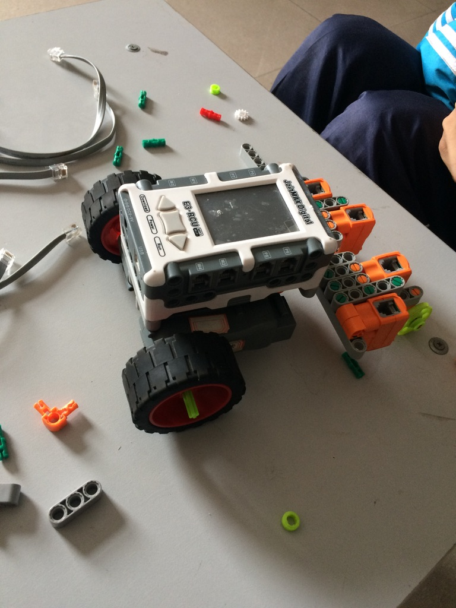

I signed up for my GitHub account on August 28, 2015. I was 14, a middle school student. I had a MacBook Air (mid 2013, 4GB memory + 128GB disk). I got this MacBook during a trip to Taiwan with my mom years earlier. The trip was nice, but it's been more than a decade and I've almost forgotten the details. My mom gifted it to me, hoping I would study hard using the technology.

On the one hand, I made it. I studied and moved to San Francisco from a small city in China, working as a software engineer, and becoming somewhat well-known (sometimes called a KOL, but I don't identify myself as such) on social media. But at the time, I was not. I mostly wanted to play games on the laptop.

### 2013 - 2015

Fortunately, I didn't know about Steam at the beginning. I started learning programming instead. I had already bought some programming books and began reading them. They covered C and Visual Basic—some very famous titles. One was "C Primer Plus, 5th Edition" with a blue outline. I really liked it, and after a few years of use, its edges had darkened from handling. But I still didn't know how to program actually. Because it just ran in the terminal, you just write some if-else, for loops, and print some characters. This is boring to be honest. Because I was using XCode because it's OS X (macOS now), I started coding Objective-C by chance. And tried to make some iOS apps. I liked a girl at the time, I imagined if I could make something for her. She liked me, so sometimes when I brought the book to school, we read together.

### 2016

I graduated from middle school to high school. There was a high school entrance exam. She was smart and consistently ranked at the top of the school in every exam, but I wasn't at her level. I remember my English teacher having me stay after school to catch up on homework. She asked, "Can't you just try a little harder? English is easy." One night after that conversation, something clicked for me. I spent the entire night reading an English grammar book. After that, my score on every English exam was never below 100/120—a significant improvement from my previous scores, which were below 90. I pushed myself hard at the end of middle school. I had been among the bottom 10 students at the beginning, but before graduation, I made it into the top 10. The story here could have been romantic, but it wasn't: I missed getting into her high school by just 2 points, which devastated me. Being poor at communication, we broke up. I often think I could have done something different when I had the chance, I feel regret whenever I think about it. Now looking back, I've been stuck on it for a long time until 6 years later. At first, I thought I could study hard and maybe attend the same university as her. After one semester, I realized I couldn't—I had absolutely no interest in subjects I didn't like. Meanwhile, I felt terrible. The stress was overwhelming because in China, every student competes for good grades on the university entrance exam, supposedly securing a promising job, future, or whatever else. I didn't buy into that system since I already felt like I'd failed. I didn't believe life should be dictated by others' rules. So I started taking it easy and continued learning programming throughout high school.

### 2017

I joined a robot club in my high school this year. The club involved either using a low-code UI or writing C programs to program small cars that would follow white lines on the ground. The fastest car would win the competition. It was quite interesting, and I won second prize at the provincial level. Although I didn't win first place, my coach was really eager for me to succeed—he had been winning competitions for a long time.

After that, I participated in an app development competition where I learned Swift to create a diary app. It essentially allowed users to take notes and manage a calendar (similar to iOS Journal, though not quite as polished). I won a prize for this project as well.

Around that time, Windows 10 had just launched with a new technology called UWP (Universal Windows Platform). I spent my entire summer vacation watching official development tutorials and built a UWP app, which was a todo list app that I published on the Windows Store. I remember it reached about 1,000 downloads, but I removed it from the store after a year since I couldn't maintain it. During this period, I also started learning Unity, as UWP uses C# as well. I experimented with creating some 2D games and collaborated with another student from my high school. This collaboration led us to start using GitHub, where we created an organization and began pushing our code.

I made all these apps public on GitHub. Even today, they haven't received any stars, but I felt accomplished knowing I was creating something meaningful.

### 2018

This year, I started participating in algorithm competitions. I missed the registration deadline for sophomores because I only found out about it after the cutoff date. Regardless, I began learning algorithms—partly because competing gave me a legitimate reason to skip classes. There's also a vibrant community of programming enthusiasts online who participate in these competitions. While I don't particularly enjoy the competitive aspect (it feels like just another exam in a different format), I genuinely love coding.

By chance, I discovered Luogu, a LeetCode-like platform for high school students. They were looking for a part-time frontend developer. I wanted the job because the community seemed cool, so I started learning frontend development. Although I had learned HTML and CSS in elementary school from computer magazines, this was my first time working with frameworks like Vue.js and React.js to build actual products.

I didn't pass the interview initially, but they were severely understaffed and I was extremely passionate about the role. So they brought me onto the team, even if just for three months. I read real product code for the first time. It was a huge mindset change for me.

About the algorithm competition—I ended up with only 80/600 points, which really disappointed me. Since I knew it wasn't my thing, I didn't spend much time preparing. Still, I can't help feeling sad because I thought I could score 200-300, but my anxiety got the better of me.

### 2019

It wasn't good for me as a student attending the university entrance exam in just a few months. I barely studied at school. If you had looked at my GitHub at the time, you'd see I made commits every day. I would sleep through classes and program after getting home, coding until 2 AM. I also collaborated with people from Sina on a web server framework—a wrapper for Koa.js. It has 1k stars on GitHub now, and it was the first open source repository I seriously invested time in.

But I had no hope for the exam. In the end, I got into a basic public university (ranked around 250 in China—not top tier at all!). During the summer vacation, I met some internet friends in person for the first time. We attended a hackathon at SJTU, and I flew to Shanghai. It was amazing.

However, my university was far from any major city—like the distance from the Midwest U.S. to New York. So I spent most of my time on GitHub. I enjoyed frontend development after my previous job, so I built lots of projects on GitHub. Most importantly, I started contributing to Node.js core. I had discovered a bug while setting up a Minecraft server locally using Node.js. This made me realize that even widely-used projects aren't perfect, so I began contributing to almost everything whenever I found bugs.

I also got another part-time job in my first year of university, building their website using React. I earned about $800 per month. I was thrilled because I finally had money, and the average cost of living around me was just $200. At that time, I would spend half my income going to the shopping center and staying overnight at a nearby hotel once a month.

### 2020

I think this was a very pivotal moment for me, and for most people—COVID-19. I had to stay at home, even though I liked it. But I got the alone time to think about my future. I was thinking about going to Japan once I graduated, maybe taking a master's degree. But I was already a guy on Chinese social media, like 10K followers on Zhihu, the Chinese version of Quora. So someone gave me the idea to go to the United States, and connected me with a CS professor in the US. I thought okay, let me try. So I put time into English exams, preparing for applications. And I made it. So I quit the university for the US one.

Because I had tons of time when staying at home, I became a Node.js core member, since I contributed a lot. And I started learning operating systems, socket networks, compilers—everything related to CS was mostly interesting to me.

### 2021

Since I couldn't attend in person, I decided to travel throughout China instead. I visited Shanghai, Guangzhou, and Hainan. Eventually, I grew bored and thought I should find a job before flying to the US. I secured an internship at Maskbook, a Web3 company, where I worked on strong authentication using public key cryptography. Since WebCrypto wasn't very popular at the time, I spent several days reading through various RFCs. I really enjoyed that period, especially working alongside my colleagues and making new friends.

When I arrived in the US, it was a completely new environment for me. I could barely understand English—whether in class or when buying lunch. I felt incredibly lonely again. Fortunately, I joined a club where many people helped me through this difficult time. Every weekend, I went to church and stayed until the very end because the only things I enjoyed doing at home were coding or playing games.

### 2022

I collaborated with a professor at the university, where I was developing UI components for their NLP functions. At that point, I felt it was the right moment to transform the idea into a real product. The professor and I co-founded a company together and secured seed funding from Miracleplus (the Chinese equivalent of YC). I focused on the overall product development.

If you look at today's open-source landscape, our product would be similar to Dify or other low-code platforms—featuring drag-and-drop interfaces, node connections, and data visualization in graphs. However, I eventually realized that implementing all these features was too stressful for me. I was too much of a perfectionist at the time.

Eventually, I left and joined another open-source project that was building a Notion-like application using CRDT technology. Interestingly, I had also been using CRDT in my previous low-code project.

### 2023

After I came to the US, I was in about three serious relationships (after 2016). They didn't go well. Things were good in the beginning, but over time I became unhappy because they weren't what I expected. I realized I couldn't solve my loneliness through relationships. I didn't have the wisdom to stop repeating the same mistakes.

I spent a lot of time on that open source project. Even today, I'm the top contributor. I really love the project, but when I saw some drama among the team members and thought about the future, I felt pretty discouraged about the repository. My friend told me to leave. Maybe I should have just left without saying anything. I was childish—I really loved the project, but eventually I realized I was just someone who happened to be there to help accomplish other people's dreams. It was like waking up from a dream.

So I started doing something else. In the first month after leaving, I played video games every day. To date, I've played about 1,400 hours of Age of Empires 4, and I believe I'm in the top 1k players. (Though RTS is a dead game—there are no players.)

Meanwhile, I started contributing to tons of open source projects on GitHub. I became a Jotai member since I really like the concept and have reported many bugs.

### 2024-2025

I can't say much—it's too recent. I don't have a clear perspective on most things yet.

But one thing I've realized is that I'm getting older. I can't stay up late anymore. I need to sleep 10 hours a day or I feel exhausted. In 2025, I paid almost $10k in taxes, which brought another level of stress. I think I need to reconsider my future, my career, and what I really want.

Besides all of that, I'm still contributing to open source, because I really like it.
